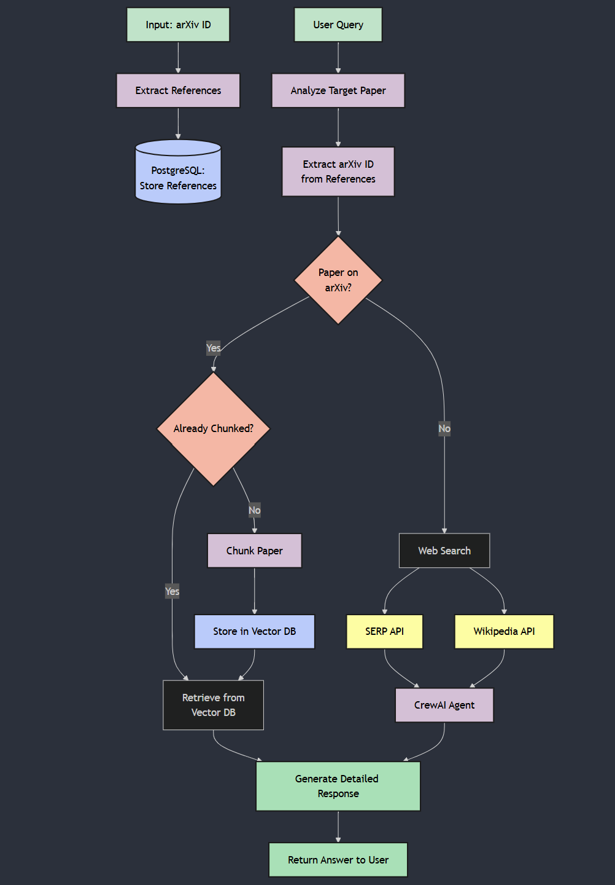

# RefReader - Intelligent Research Paper Analysis System

RefReader is an advanced system designed to analyze research papers and their references, providing detailed responses to user queries by leveraging both ArXiv papers and web-based resources.

## 🚀 Overview

RefReader serves as a comprehensive research assistant that can:
- Process and store references from ArXiv papers
- Analyze research papers based on user queries
- Provide intelligent responses using vector-based retrieval and web search
- Maintain an efficient database of processed papers for quick access

## 🎥 Demo

Check out RefReader in action:

<video width="600" controls>
  <source src="demo-video/Ref-reader-demo.mp4" type="video/mp4">
  Your browser does not support the video tag.
</video>

## 🏗️ Architecture

The system follows a multi-path architecture for processing queries. Here's an interactive version of the architecture:

### ArXiv Paper Processing Path
1. Extracts references from input ArXiv IDs
2. Stores references in PostgreSQL database (using **Supabase** for cloud-based management)
3. For papers available on ArXiv:
   - Checks if paper is already processed
   - If not processed, chunks the paper and stores in **Qdrant Vector Database**
   - Retrieves relevant information from vector database

### Web Search Path
For papers not available on ArXiv:
- Utilizes **SERP API** for web search
- Integrates **Wikipedia API** for additional context
- Processes information through **CrewAI Agent**

## 💾 Data Storage

The system employs two primary storage solutions:
- **PostgreSQL Database (Supabase)**: Stores paper references and metadata
- **Qdrant Vector Database**: Maintains chunked paper content for efficient retrieval and semantic search

## 🔍 Key Features

- **Intelligent Query Processing**: Analyzes user queries and extracts relevant ArXiv IDs
- **Retrieval-Augmented Generation (RAG)**: Combines vector-based retrieval with LLM-powered answer synthesis
- **Adaptive Search**: Automatically switches between ArXiv and web-based sources
- **Efficient Retrieval**: Uses vector database for quick access to processed papers
- **Comprehensive Response Generation**: Combines multiple data sources for detailed answers

## 🛠️ Components

1. **Reference Extractor**: Processes ArXiv papers to extract references
2. **Query Analyzer**: Interprets user queries and determines search strategy
3. **Paper Chunker**: Breaks down papers into manageable segments
4. **Vector Store (Qdrant)**: Maintains processed paper segments for quick retrieval
5. **CrewAI Agent**: Integrates web search results with paper content
6. **Response Generator (RAG-based)**: Creates detailed, contextual responses by combining retrieved data and LLM-generated insights

## ⚡ Performance Optimization

- Papers are processed and chunked only once
- **Qdrant Vector Database** enables fast similarity search
- **Supabase PostgreSQL** efficiently manages metadata and references
- Cached results reduce processing time for frequent queries

## 🔄 Process Flow

1. User provides ArXiv ID or query
2. System checks paper availability on ArXiv
3. If available:
   - Checks if already processed
   - Retrieves from **Qdrant Vector Database** or processes new paper
4. If not available:
   - Performs web search using **SERP and Wikipedia APIs**
5. Generates comprehensive response using **RAG techniques**
6. Returns formatted answer to user

## 🎯 Retrieval Techniques

The system employs a sophisticated two-stage retrieval process for optimal results:

### 1. Metadata Filtering
- First applies a metadata filter using the ArXiv ID
- Reduces the search space to only relevant document chunks
- Ensures context specificity and improves response accuracy
- Utilizes Qdrant's filtering capabilities for efficient document selection

### 2. Semantic Search
- Performs semantic similarity search on filtered documents
- Uses Azure OpenAI embeddings for query and document vectors
- Implements cosine similarity scoring for ranking
- Selects top 4 most relevant chunks for response generation

### Optimization Features
- Pre-filtering by metadata reduces computation overhead
- Cosine similarity calculations only performed on relevant subset
- Maintains context coherence by focusing on specific paper sections
- Balances between search speed and result quality

## 🎯 Use Cases

- Research paper analysis
- Literature review assistance
- Reference exploration
- Quick paper summaries
- Cross-reference checking

## 📝 Note

This system is designed to maintain a growing database of processed papers, improving response time and accuracy as more papers are analyzed. It leverages **Retrieval-Augmented Generation (RAG)** to provide high-quality answers by combining structured vector search with large language models.

